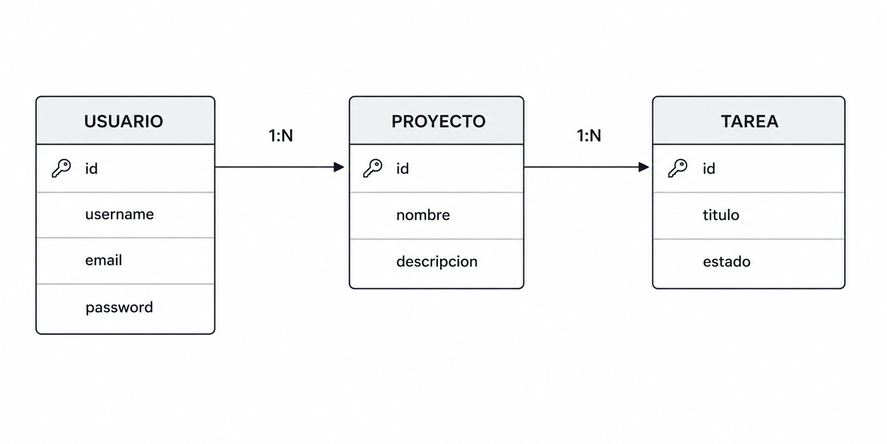

# Proyecto Final — TaskFlow

## Descripción

Desarrollar una aplicación utilizando **Django y Django REST Framework** para gestionar proyectos y tareas.

El proyecto debe integrar los principales conocimientos aprendidos durante el módulo.

---

## Modelo Entidad-Relación (MER)

### Relaciones

- **USUARIO 1:N PROYECTO**
  - Un usuario puede tener varios proyectos.
  - Cada proyecto pertenece a un usuario.

- **PROYECTO 1:N TAREA**
  - Un proyecto puede tener varias tareas.
  - Cada tarea pertenece a un proyecto.

---

## Requisitos del proyecto

### 1. Proyectos y tareas

Implementar un CRUD para:

- Proyectos.
- Tareas.

Cada usuario solo podrá gestionar sus propios recursos.

### 2. Autenticación y autorización

Implementar:

- Registro e inicio de sesión.
- Protección de vistas.
- Control de permisos.
- Restricción de acceso a recursos de otros usuarios.

### 3. Formularios

Utilizar formularios de Django e implementar:

- `GET` y `POST`.
- `ModelForm`.
- Validación de datos.
- Protección CSRF.

### 4. API REST

Crear una API utilizando **Django REST Framework**.

Debe incluir:

- `ProyectoSerializer`.
- `TareaSerializer`.
- CRUD mediante `ModelViewSet`.
- Al menos un endpoint utilizando `APIView`.

Ejemplo:

`GET /api/tareas/pendientes/`

### 5. Autenticación JWT

Implementar autenticación mediante JWT.

Endpoints mínimos:

- `POST /api/token/`
- `POST /api/token/refresh/`

Los endpoints protegidos deberán requerir autenticación mediante JWT.

El proyecto deberá demostrar el uso de:

- Access Token.
- Refresh Token.

### 6. Seguridad y buenas prácticas

Implementar:

- Variables de entorno.
- `.env` incluido en `.gitignore`.
- `DEBUG=False` para producción.
- Protección de recursos según el usuario autenticado.
- Al menos 2 pruebas.
- Al menos un ejemplo de logging.
- Al menos un uso de `select_related()` o `prefetch_related()`.

### 7. Documentación

La API deberá contar con documentación mediante **Swagger/OpenAPI**.

El proyecto deberá incluir un `README.md` con las instrucciones necesarias para ejecutarlo.

---

### Entrega

#### Fecha límite

**4 de septiembre de 2026**

#### Repositorio

Publica tu proyecto en **GitHub** (u otra plataforma de control de versiones). El repositorio debe contener todo el código fuente.

#### README.md

Tu `README.md` debe incluir:

- **Descripción del proyecto**
- **Requisitos** previos
- **Instalación** de dependencias
- **Configuración** de variables de entorno (`.env` en `.gitignore`)
- **Configuración** de la base de datos
- **Ejecución** de migraciones
- **Creación** del superusuario
- **Ejecución** del servidor de desarrollo
- **Acceso** a la documentación de la API (Swagger/OpenAPI)
- **Cómo ejecutar** las pruebas

#### Envío

Una vez finalizado, envía un correo electrónico a:

**juancondori_doc@usip.edu.bo**

Con los siguientes datos:

- Nombre completo del estudiante
- Enlace al repositorio de GitHub

**Celular de contacto:** 78816339

> **Nota:** El trabajo se evaluará principalmente por la **funcionalidad**, la correcta aplicación de Django, Django REST Framework, autenticación, seguridad y buenas prácticas.